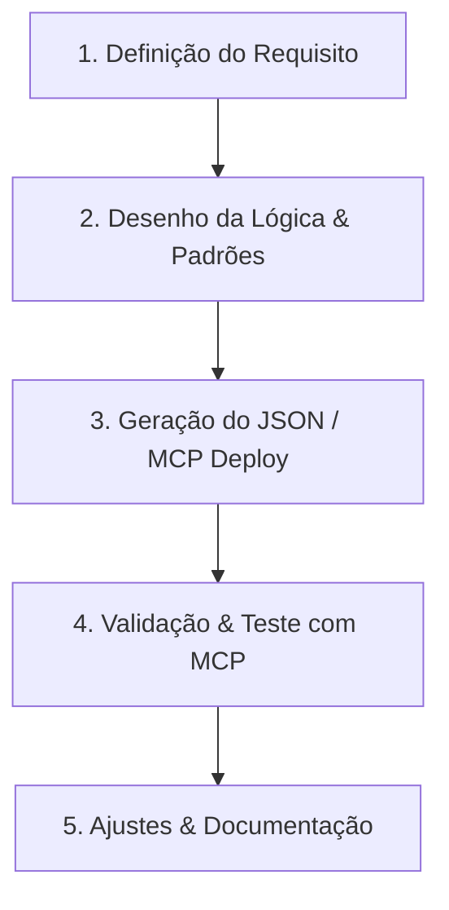

# 🌌 Projeto Antigravity: Automações de Alta Performance com n8n

Este repositório serve como base de conhecimento, versionamento e desenvolvimento colaborativo de fluxos de trabalho (workflows) do **n8n**. O objetivo principal é estruturar integrações robustas, inteligentes e eficientes utilizando o agente **Antigravity** em conjunto com as ferramentas e habilidades dedicadas ao ecossistema n8n.

---

## 🛠️ Pilares da Integração

Para garantir que os fluxos sejam desenvolvidos sem suposições incorretas e com validação em tempo real, utilizaremos duas integrações fundamentais assim que o acesso for configurado:

### 1. 🔌 n8n MCP Server ([n8n-mcp](https://github.com/czlonkowski/n8n-mcp))
O servidor **Model Context Protocol (MCP)** do n8n atua como uma ponte direta entre o Antigravity e a sua instância do n8n.
* **Documentação Viva:** Permite consultar em tempo real as propriedades e operações de mais de 1.600 tipos de nós do n8n.
* **Gestão Ativa:** Capacidade de buscar, criar, atualizar e validar fluxos diretamente no servidor n8n a partir do chat.
* **Execuções & Testes:** Acionamento de execuções de teste e monitoramento de logs de execução para depuração rápida.

### 2. 🧠 n8n Skills ([n8n-skills](https://github.com/czlonkowski/n8n-skills))
Um conjunto de habilidades especializadas que fornecem ao Antigravity o conhecimento técnico profundo para construir automações robustas:
* **Expression Syntax:** Garantia de uso correto da sintaxe de expressões do n8n (ex: `{{ $json.myVariable }}`) evitando erros comuns de tipagem e referência.
* **Workflow Patterns:** Padrões arquiteturais validados (tratamento de erros global, sub-workflows, filas, processamento em lote).
* **Validation Expert:** Resolução rápida de inconsistências de configuração e erros de schema.
* **JavaScript / Python em Nós de Código:** Otimização de scripts internos dos nós `Code`, utilizando os métodos corretos de mapeamento de dados (ex: `$input.all()`).

---

## 📂 Estrutura Proposta para o Workspace

Para organizar as automações de forma profissional, utilizaremos a seguinte estrutura de diretórios no workspace:

```text
Suprimatica/
├── Antigravity.md           # Este guia de fluxos e diretrizes
├── workflows/               # Armazenamento dos fluxos em formato JSON
│   ├── [nome-do-fluxo]/
│   │   ├── workflow.json    # Export completo do fluxo do n8n
│   │   └── README.md        # Documentação detalhada deste fluxo específico
│   └── templates/           # Modelos reutilizáveis de fluxos
└── scripts/                 # Scripts auxiliares (JS/Python) usados nos nós Code
```

> [!TIP]
> Manter os arquivos `workflow.json` versionados no diretório permite versionamento completo do fluxo, facilitando a restauração de versões anteriores e o trabalho colaborativo.

---

## 📝 Documentação Individual de Fluxos

Cada workflow dentro da pasta `workflows/[nome-do-fluxo]/` deve conter um `README.md` estruturado contendo:

1. **Objetivo:** Descrição clara do que o fluxo resolve.
2. **Gatilhos (Triggers):** Como o fluxo inicia (Webhooks, Cron/Schedule, Eventos).
3. **Variáveis de Entrada (Payload):** Exemplo de JSON esperado no início do fluxo.
4. **Credenciais Necessárias:** Quais serviços precisam de autenticação (OAuth2, API Keys).
5. **Tratamento de Erros:** Como o fluxo reage caso um nó falhe.

---

## 🔄 Fluxo de Trabalho Colaborativo

Quando precisarmos criar ou modificar um fluxo, seguiremos estas etapas:



1. **Definição do Requisito:** Você descreve o que a automação precisa fazer e quais APIs/serviços estão envolvidos.
2. **Planejamento:** O Antigravity estrutura a lógica, identifica os nós do n8n adequados (usando o `n8n-mcp` para validar propriedades) e define os padrões de expressão.
3. **Criação/Atualização:** O Antigravity gera o JSON do fluxo e pode utilizar o servidor MCP para criar ou atualizar diretamente na sua instância do n8n.
4. **Validação:** Rodamos testes de execução, inspecionamos os nós de código e tratamos qualquer erro retornado.
5. **Documentação:** Versionamos o arquivo `.json` no repositório e criamos/atualizamos o `README.md` correspondente.

---

## 🚀 Como Configurar as Ferramentas no Antigravity

Siga o passo a passo abaixo para dar ao agente **Antigravity** acesso às ferramentas e habilidades especializadas do n8n no seu ambiente Windows.

### 1. Configurando o n8n MCP Server
O Antigravity lê servidores MCP cadastrados no arquivo de configuração global.
1. No seu workspace, localize o arquivo de modelo [mcp_config_template.json](file:///c:/Users/Thiago%20Lima/Downloads/Antigravity/Suprimatica/mcp_config_template.json).
2. Abra-o e substitua:
   - `https://sua-instancia-n8n.com/api/v1` pela URL da API da sua instância do n8n.
   - `sua_chave_de_api_aqui` pela chave de API gerada em sua instância do n8n (em *Settings > API > API Keys*).
3. Salve o arquivo e copie seu conteúdo.
4. Crie/edite o arquivo de configuração do Antigravity em:
   `C:\Users\Thiago Lima\.gemini\antigravity\mcp_config.json`
5. Cole o conteúdo configurado nele. Ao reiniciar o agente, a integração estará ativa!

### 2. Instalando as n8n Skills
Para injetar as regras e conhecimento técnico do n8n no agente:
1. Abra um terminal do PowerShell e clone o repositório de skills:
   ```powershell
   git clone https://github.com/czlonkowski/n8n-skills.git
   ```
2. Crie a pasta de destino das skills do Antigravity (se ainda não existir):
   ```powershell
   New-Item -ItemType Directory -Force -Path "C:\Users\Thiago Lima\.gemini\antigravity\skills"
   ```
3. Copie todos os arquivos `.md` da pasta `skills/` do repositório clonado para a pasta do Antigravity:
   ```powershell
   Copy-Item -Path "n8n-skills\skills\*" -Destination "C:\Users\Thiago Lima\.gemini\antigravity\skills\" -Recururse -Force
   ```
4. Reinicie o chat/agente para que as novas habilidades sejam carregadas.

---

## 💡 O que podemos fazer agora?
Enquanto você realiza as configurações de acesso acima, posso te ajudar nas seguintes tarefas:
* 🗺️ **Desenho de Fluxos:** Planejar a arquitetura conceitual de novos fluxos de trabalho.
* 💻 **Nós de Código:** Escrever e validar scripts JavaScript ou Python otimizados para nós `Code` do n8n.
* 🔤 **Expressões:** Mapeamento de dados e construção de expressões complexas.
* 📝 **Documentação:** Criar arquivos de documentação para automações que você já possui prontas.

---
*Criado por Antigravity em parceria com Thiago Lima.*
